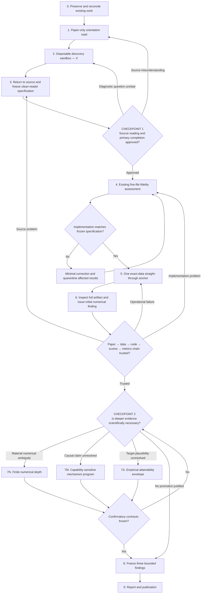

# Clean-reader reproduction rebase — Evidence Plan

**Created:** 2026-08-23

**Status:** Active governing plan; Checkpoint 1 approved 2026-08-24

**Current state:** Phase 5 operationally `COMPLETE`: sole job `384390` exited
`0:0` on 2026-08-30 after 9:14:27 under the approved semantic allocation `I`
branch. Phase 6 is `COMPLETE`: independent audit passed, the bounded Table-III
FC-SAE non-reproduction is saved, and Checkpoint 2 awaits user review.
The exact official-serialization failure remains preserved.
The initial finding is now published as an in-progress report, explicitly
approved by the user on 2026-08-31. This editorial publication does not complete
Phase 9's final three-finding report or open Checkpoint 2 to experiments.

**Supersedes:**
[`2026-08-09-paper-1-minimal-finish.md`](2026-08-09-paper-1-minimal-finish.md)
for execution order. The earlier plan remains preserved as historical context.

**Governing decisions:**

- [`../decisions/2026-08-09-paper-first-minimal-instrument.md`](../decisions/2026-08-09-paper-first-minimal-instrument.md)
- [`../decisions/2026-08-11-non-executable-source-ladder.md`](../decisions/2026-08-11-non-executable-source-ladder.md)
- [`../decisions/2026-08-20-three-part-evidence-frame.md`](../decisions/2026-08-20-three-part-evidence-frame.md)
- [`../decisions/2026-08-24-clean-reader-first-anchor-freeze.md`](../decisions/2026-08-24-clean-reader-first-anchor-freeze.md)
- [`../decisions/2026-08-30-clean-reader-semantic-allocation-admission.md`](../decisions/2026-08-30-clean-reader-semantic-allocation-admission.md)

## Goal

Determine whether a competent independent reader, using the publication, its
named data, and only predeclared minimal completions of unavoidable omissions,
can reconstruct the method and recover its complete reported numerical result
pattern.

Do this through a paper-only orientation, a disposable discovery sandbox, a
source-located clean-reader freeze, a fidelity assessment of the existing
five-file implementation, and one preserved exact-data anchor. Only after that
anchor is trusted may unresolved numerical, mechanism, or attainability
questions be promoted to deeper work.

## First finish condition

The first program is complete when:

1. a source-located clean-reader specification is frozen;
2. every unavoidable assumption is visible and chosen before its eligible
   outcome;
3. the existing five-file implementation is either verified against that
   specification or minimally corrected with prior results quarantined;
4. one exact-data straight-through attempt is preserved; and
5. the complete reported pattern is compared with that attempt under a bounded
   initial numerical finding.

More model families, branches, seeds, infrastructure, or documentation are not
substitutes for this finish condition.

## Governing question and classifications

**Primary evidence question:** Numerical reproduction (`N`).

**Discovery classification:** Exploratory (`X`) until the clean-reader source
freeze.

**Formal implementation classification:** Paper-literal (`P`) where the text
executes; reasonable interpretation (`I`) only where a necessary omission or
contradiction prevents execution. Controlled work (`C`) is excluded from the
primary anchor.

**Primary question:**

> Can a competent independent reader reproduce the complete reported result
> pattern from the publication and named data without result-guided choices?

**Initial competing explanations:**

1. The printed procedure or its minimal ordinary completion reproduces the
   reported pattern.
2. The clean-reader implementation is wrong or incomplete.
3. A materially different but source-supported completion is required.
4. The described method does not reproduce the pattern inside the declared
   clean-reader contract.
5. An undocumented procedure outside the contract was used; this remains open
   and is never inferred merely from a non-match.

## Full state flow

The arrows back to earlier phases are part of the plan. Looping back is not a
failure if the reason and evidentiary impact are recorded. No result is deleted
or silently relabeled when a loop occurs.

## State tracker

Update this table whenever a phase begins, completes, is blocked, or is
reopened. At most one phase may be `IN PROGRESS`.

| Phase | State | Entry requirement | Exit artifact or decision |
|---|---|---|---|
| 0. Preserve and reconcile | `COMPLETE` | Plan accepted as governing | Existing-artifact classification and no-new-run gate |
| 1. Paper-only orientation | `COMPLETE` | Phase 0 complete | Provisional numerical and causal claim map |
| 2. Discovery sandbox | `COMPLETE` | Orientation map exists | Sandbox log and discriminating questions |
| 3. Clean-reader source freeze | `COMPLETE` | Sandbox questions recorded | Frozen specification and assumptions register |
| Checkpoint 1 | `COMPLETE` | Phase 3 complete | User approval or explicit loop-back |
| 4. Fidelity assessment | `COMPLETE` | Checkpoint 1 approved | Claim-to-code-to-data trace, corrected route, and quarantine list |
| 5. Exact-data anchor | `COMPLETE` | Fidelity passes | Job 384390 completed once; immutable attempt seed_20260824_2f483335536c saved; independently audited in Phase 6 |
| 6. Initial numerical finding | `COMPLETE` | User approved inspection of the sole completed anchor | CLEAN_READER_FINDING.md; frozen audit and 65 supplemental checks passed |
| Checkpoint 2 | `PENDING` | Trusted initial finding | Promote `N`, `M`, `A`, or stop |
| 7N. Numerical depth | `PENDING` | Material numerical question promoted | Finite branch/repetition assessment |
| 7M. Mechanism program | `PENDING` | Source causal claim promoted | Supported/contradicted/unidentified causal links |
| 7A. Attainability envelope | `PENDING` | Plausibility question promoted | Declared envelope and conditional conclusion |
| 8. Three findings | `PENDING` | Promoted programs complete or explicitly untested | Frozen `N/M/A` findings |
| 9. Reporting | `PENDING` | Findings frozen | Verified report and publication artifacts |

## Phase 0 — Preserve and reconcile existing work

### Question

What work already exists, what question did each artifact actually answer, and
what may safely inform the clean-reader program without determining its source
interpretation?

### Actions

- Launch no new preparation, training, scoring, branch, or repeated-seed job.
- Harvest and preserve already-completed external outputs when accessible; do
  not treat harvesting as authorization for additional execution.
- Inventory existing source notes, code, caches, attempts, failures, score
  arrays, analyses, and reports.
- Classify each material artifact provisionally by:
  - evidence question: `N`, `M`, `A`, or none;
  - implementation semantics: `P`, `I`, `C`, or `X`;
  - status: eligible candidate, exploratory, fixture, operational evidence,
    quarantined, or unresolved; and
  - whether it can influence the clean-reader source interpretation.
- Preserve existing artifacts in place. Do not delete, overwrite, or
  retroactively preregister them.

### Exit condition

A compact reconciliation table identifies what exists and establishes a hard
boundary: prior results may suggest questions but cannot select the new primary
reading.

## Phase 1 — Paper-only orientation read

### Question

What would an independent competent reader believe the paper claims and asks
them to execute before seeing project code or outcomes?

### Actions

- Fingerprint and visually inspect the complete source from first page to last.
- During this pass, do not consult the existing implementation, branch matrix,
  or numerical outcomes.
- Record provisionally:
  - every headline numerical target;
  - the paper's straight-through data-to-result flow;
  - every explanatory claim expressible as `B > A because Z exploits S`;
  - table-level red flags and static feasibility questions;
  - explicit omissions, contradictions, and non-executable wording; and
  - the smallest questions a sandbox could discriminate.
- Store source locators for every consequential claim.

### Exit condition

A provisional source-only orientation map exists. It is not yet the formal
specification and contains no result-guided completion.

## Phase 2 — Disposable discovery sandbox

### Question

Do we understand the written procedure and which small observations would
distinguish implementation error, task triviality, absent capability, and a
genuine architectural effect?

### Actions

- Use the smallest disposable script or notebook; avoid the production runner,
  cluster layer, full dataset, and historical branch machinery.
- Instantiate only the minimum recognizable systems needed for the immediate
  question.
- Check shapes, output domains, one finite update, and hand-sized overfitting.
- Use toy or synthetic data where the claimed structure is irrelevant, useful,
  and necessary.
- Compare zero-parameter and simple fair rules before interpreting elaborate
  architectures.
- Inspect per-example scores, rankings, and representations rather than only a
  headline metric.
- Record question, minimal setup, observation, affected explanations, and
  whether a formal test should be promoted.

### Boundary

All sandbox work is `X`. It may expose a coding error or motivate a formal
question. It cannot reproduce the paper, select a favorable interpretation,
or become confirmation retrospectively.

### Exit condition

The sandbox log identifies the smallest discriminating questions and any
misunderstandings that require another paper pass.

## Phase 3 — Return to the source and freeze the clean-reader specification

### Question

What exact procedure can an ordinary independent reader execute without using
the reported result to fill omissions?

### Actions

- Re-read every source location implicated by the orientation and sandbox.
- Freeze the literal `P` procedure, including explicit failure where a printed
  operation cannot execute.
- For every execution-blocking omission or contradiction, record:
  - the printed wording and locator;
  - why the literal operation fails or is underdetermined;
  - the smallest ordinary `I` completion;
  - other materially distinct source-supported completions, listed but not yet
    executed; and
  - why the primary completion was chosen without outcomes.
- Freeze exact data identity, sample unit, preparation order, model, training,
  score, threshold, metrics, seed, and first-attempt stopping behavior.
- Separate the primary clean-reader path from later `C` controls and unrelated
  `X` possibilities.
- Update the source specification with both numerical and causal claim maps.

### CHECKPOINT 1 — User review

Before formal implementation or execution, review:

- the literal procedure and failures;
- the primary reasonable-reader completion;
- every unavoidable assumption;
- the complete reported target pattern;
- competing explanations and disconfirming outcomes; and
- the exact first-anchor finish condition.

If the paper reading is disputed, loop to Phase 1. If the discriminating
question is weak, loop to Phase 2. Approval authorizes fidelity assessment, not
an ambiguity sweep or repeated seeds.

## Phase 4 — Existing five-file fidelity assessment

### Question

Does the current minimal implementation directly execute the approved
clean-reader specification?

### Actions

- Trace each consequential source instruction through code, prepared data,
  configuration, score, metric, and persisted result.
- Compare runtime layers, shapes, domains, transformations, population
  identities, score direction, and metric formulas with the freeze.
- Reuse matching code. Do not rewrite for elegance or architecture.
- If a mismatch exists, quarantine affected historical results, make only the
  smallest correction needed by the frozen specification, and rerun the
  fidelity check.
- Pass deterministic tiny-data, one-step, score-direction, and metric checks.

### Exit condition

The approved clean-reader specification has one transparent executable route,
or a literal operational failure is preserved and reported.

## Phase 5 — One exact-data straight-through anchor

### Question

What happens when the approved clean-reader route is executed once, without
branching or tuning toward the target?

### Actions

- Before execution, record the table/claim, `N` question, `P/I` semantics,
  exact data hash, model, seed, predictions, budget, stopping rule, and report
  finding it feeds.
- Admit an existing attempt only if its complete provenance and configuration
  exactly match the approved freeze.
- Otherwise run one watched exact-data attempt through the five-file route.
- Preserve failures, histories, scores, predictions, identities, metrics,
  timings, configuration, environment, and hashes.
- Do not add seeds, branches, corrected controls, or model-family coverage.

### Exit condition

One immutable attempt or literal operational failure represents the approved
clean-reader path.

## Phase 6 — Inspect and issue the initial numerical finding

### Question

Did the straight-through independent reimplementation recover the complete
reported pattern, and is the entire measuring chain trustworthy?

### Actions

- Reload every persisted artifact and regenerate every metric.
- Inspect score distributions, direction, thresholds, identities, failures,
  and complete-pattern distance from the target.
- Compare with trivial and positive controls only as diagnostics; do not let
  them overwrite the numerical finding.
- State separately:
  - whether the literal method executed;
  - whether the approved minimal completion executed; and
  - whether its complete result pattern reproduced.
- If inspection reveals a source problem, return to Phase 3. If it reveals an
  implementation problem, return to Phase 4. If it reveals a transient
  operational failure without scientific change, return to Phase 5.

### Exit condition

A bounded initial numerical finding is recorded without claiming statistical
finality, mechanism failure, attainability, intent, or universal impossibility.

### 2026-08-31 artifact-audit scope

The user approved Phase 6 for `CR-ISET-FCSAE-01`, Table III ISET FC-SAE,
seed `20260824`, `P+I/N`, immutable attempt `seed_20260824_2f483335536c`.
The question is whether the recorded numerical gap survives an independent
check of the measuring chain. Competing audit outcomes are a preserved defect
requiring a source/code loop-back, or matching provenance/arrays/metrics that
permit the bounded initial numerical finding. Run the frozen fail-closed audit
from eligible commit `a88d17477ad96b01ffa44a50d8ce051dd8d2b5ca`, then inspect
finite values, sample identities, stopping history, and fresh-load weight/score
agreement without training, tuning, or changing thresholds. A short CPU
allocation (4 cores, 16 GiB, at most 20 minutes) may perform these checks; no
new scientific model attempt is authorized. Preserve audit output beside the
attempt and copy small provenance/result/audit records into the study. Stop at
Checkpoint 2 after recording the complete target comparison and limitations.

## CHECKPOINT 2 — Promotion after the anchor

Review the trusted anchor and choose only questions whose expected information
gain justifies additional work:

- **`N`:** a materially distinct source-supported interpretation or repetition
  needed to stabilize the numerical finding;
- **`M`:** a source-located causal claim whose competing explanations can be
  separated by a capability-sensitive test; or
- **`A`:** a target-plausibility question with meaningful response axes and a
  finite empirical envelope.

No paper row, model family, ambiguity, or seed is promoted merely because it
exists.

### Proposed next questions after publication — 2026-08-31

These are a discussion proposal, not an approved or preregistered run contract.
Keep the audited reproduction unchanged and begin with cheap diagnostic breadth:

1. **Conditional performance bound (`A`).** For the fixed prepared inputs,
   score definition, and output domain, derive each input's allowed score
   interval. Give every example an optimistically chosen, even label-aware
   reconstruction and optimize a single shared cutoff. Failure even with this
   extra freedom could rule out the target under the stated assumptions,
   independent of weights or seed. A feasible target leaves the bound
   inconclusive; it does not show that a trainable model can reach it.
2. **Incremental useful information (`M`).** On preserved scores/data, compare
   the trained score with no-learning input statistics, including per-attack
   and similar-input-magnitude comparisons. Distinguish useful ranking changes
   from nearly identical aggregate scores. State a meaningful effect before
   any equivalence claim; uncertainty must respect customers and synthetic
   dependencies, not count millions of related rows as independent trials.
3. **Small discriminating controls (`N/M`).** If needed, use a capped sandbox
   with positive controls and checked fitting to distinguish absent signal,
   the reconstruction objective/output restriction, and optimization failure.
   Separate source-supported interpretations from corrected controls.

Before execution, record competing predictions, the smallest setup, sample and
compute caps, and stopping/promotion rules. Only a surviving question justifies
another full training run, repeated seeds, or another table. Do not repeat the
completed artifact audit or threshold enumeration without a specific new issue.

## Phase 7N — Finite numerical depth

Freeze the smallest set of materially distinct `I` branches and repetitions
needed for the numerical finding. Vary one ambiguity at a time. Preserve all
attempts and report complete patterns with uncertainty. Do not execute an
arbitrary Cartesian product.

## Phase 7M — Capability-sensitive mechanism program

For each promoted `B > A because Z exploits S` claim, test separately whether
`S` exists and matters, `A` lacks the capability, `Z` supplies it, trained `B`
uses it, and that use causes a paired advantage. Use capability witnesses,
triviality controls, structure destruction, component ablation, fair matched
comparisons, and learned-behavior inspection under a frozen effect criterion.

## Phase 7A — Empirical attainability envelope

Freeze relevant axes such as source-supported completions, seeds, partitions,
capacity, data size, duration, thresholds, and compute. Record distributions,
failures, learning/capacity/search curves, plateaus, and target gaps. Treat
optimistic extrapolation as context, not a universal bound. Claim structural
impossibility only from a genuine proof under exactly stated assumptions.

## Phase 8 — Freeze three bounded findings

Issue numerical, mechanism, and attainability findings separately. Mark a
finding `not tested` when no question was promoted or the required evidence was
not obtained. The combined interpretation cannot infer author intent,
undocumented code, or an exhausted infinite space.

## Phase 9 — Report and publication

Only after the findings are frozen, update the paper report and public evidence
map, render and verify the report, and then consider a separate corrected
solution study.

## Loop-back and update protocol

This plan is a living state record, not a static checklist.

After every material session:

1. update **Current state** at the top of this file;
2. update exactly one row in the state tracker to `IN PROGRESS`, `BLOCKED`,
   `REOPENED`, or `COMPLETE` as appropriate;
3. append a dated entry to the state history below;
4. update `docs/STATUS.md` with the same current state and exact next action;
5. update `docs/CONTEXT.md` only for non-obvious facts or user emphasis;
6. update `docs/EVIDENCE-AND-LEARNINGS.md` only when evidence changes a belief;
7. identify every artifact that remains valid, becomes exploratory, or must be
   quarantined after a loop-back; and
8. commit the state update with the work it describes.

Never erase a completed state. If a phase reopens, retain its former completion
and record why the new evidence changed its status.

## State history

| Date | From | To | Reason | Evidence impact |
|---|---|---|---|---|
| 2026-08-23 | Prior numerical breadth/depth plan | Plan checkpoint | Reoriented around clean-reader reproduction before mechanism or attainability depth | Existing work preserved; no artifact retroactively reclassified |
| 2026-08-23 | Plan checkpoint | Phase 0 in progress | User approved the saved plan | Preservation and classification authorized; no scientific run authorized |
| 2026-08-23 | Phase 0 | Phase 1 in progress | Existing artifacts inventoried and fenced from the new source interpretation | No prior result admitted or relabeled; paper-only orientation authorized |
| 2026-08-23 | Phase 1 in progress | Phase 1 complete; Phase 2 pending | Complete PDF visually inspected and source-only orientation map saved | Numerical targets, causal claims, contradictions, omissions, and sandbox questions recorded without consulting prior implementation or results |
| 2026-08-24 | Phase 2 pending | Phase 2 in progress | User authorized execution of the agreed bounded sandbox wave | Toy/synthetic `X` probes authorized; no exact data, historical runner, or formal evidence execution authorized |
| 2026-08-24 | Phase 2 in progress | Phase 2 execution gate | Contract and standalone implementation frozen in `83dab57`; local SSH agent has no identity | Static checks and 173 deterministic tests pass, but no remote command, job submission, or sandbox result exists |
| 2026-08-24 | Phase 2 execution gate | Phase 2 complete; Phase 3 pending | User clarified interactive authentication; frozen job `381540` completed once and every output was inspected | Exploratory `X` questions preserved; no named data, historical runner, or formal `N/M/A` result executed; no result-guided sandbox retry |
| 2026-08-24 | Phase 3 pending | Phase 3 complete; Checkpoint 1 pending | All 12 PDF pages re-inspected; official ISSDA identity resolved; literal failures and one outcome-independent first-anchor completion frozen | `CR-ISET-FCSAE-01` is reviewable; no historical implementation was assessed and no named data or formal experiment executed |
| 2026-08-24 | Checkpoint 1 pending | Checkpoint 1 complete; Phase 4 in progress | User directed execution of the six-step sequence and required every plausible explanation to be recorded and tested systematically | Source freeze approved; explanation register active; fidelity inspection authorized, while Phase-5 run contract and Checkpoint 2 remain binding |
| 2026-08-24 | Phase 4 in progress | Phase 4 complete; Phase 5 data gate | All five direct files were traced; historical routes were quarantined; frozen mismatches were minimally corrected; 178 deterministic tests pass | One fail-closed clean-reader route exists; no historical result is eligible; exact-data execution may begin only after the official allocation `.tab` is available |
| 2026-08-24 | Phase 5 data gate | Phase 5 blocked | Exact official archive identities are locally available, but the official allocation `.tab` is absent locally and on Panther and no ISSDA token is configured | No named-data preparation, training, or score exists; the semantic CSV remains an unapproved `I` branch; Checkpoint 2 is not reached |
| 2026-08-25 | Phase 5 blocked | Phase 5 serialization gate clarified | Official metadata identifies the `.tab` as a Dataverse ingest of an original XLSX; the public ScienceDB CSV and public GitHub workbook already agree on all 6,445 allocation mappings | The data are not missing; only the exact restricted serialization is absent. The verified semantic branch remains closed pending the plan-required explicit user approval |
| 2026-08-30 | Phase 5 blocked | Phase 5 in progress | User approved `sciencedb-csv-semantic-equivalence-v1` after reviewing the distinction between allocation identity and Dataverse byte serialization | The official-serialization failure remains preserved; one visible `I` source branch may now execute the otherwise unchanged single-anchor contract |
| 2026-08-30 | Phase 5 in progress | Phase 5 ready for submission | The semantic source gate, runner, independent audit, and cluster wrapper were frozen in eligible code commit `a88d17477ad96b01ffa44a50d8ce051dd8d2b5ca`; 179 deterministic tests and the strict seven-file verifier pass | Exactly one Panther attempt is authorized; all other branches, seeds, models, controls, and retries remain closed |
| 2026-08-30 | Phase 5 ready for submission | Phase 5 job submitted | The exact frozen command submitted Panther job `384390`; initial state `PENDING (Priority)` | This is the sole authorized anchor attempt; wait, preserve its complete success or failure, audit it, and do not launch a replacement before Checkpoint 2 |
| 2026-08-30 | Phase 5 job submitted | Phase 5 job running | Panther job `384390` entered `RUNNING`; hourly thread heartbeat `monitor-clean-reader-anchor` was activated for observation and terminal audit only | The heartbeat cannot submit, retry, alter, or expand an experiment; preserve the sole outcome and stop at Checkpoint 2 |
| 2026-08-30 | Phase 5 job running | Phase 5 job running; manual checks only | User requested that `monitor-clean-reader-anchor` be disabled and that status be checked only when prompted; the automation was set to `PAUSED` | Do not perform automatic checks; the sole job and Checkpoint-2 restrictions are unchanged |
| 2026-08-31 | Phase 5 job running; manual checks only | Phase 5 complete; Phase 6 audit pending | Manual inspection found Slurm `COMPLETED 0:0`, end 2026-08-30 22:48:39 Qatar, 9:14:27 elapsed, and a saved result/metadata record | Operational completion is not yet an independently trusted numerical finding; do not submit new work or cross Checkpoint 2 |
| 2026-08-31 | Phase 6 audit pending | Phase 6 complete; Checkpoint 2 pending | User approved the audit; CPU-only job 384939 ran the frozen audit and supplemental checks on the unchanged sole attempt. All metrics regenerate exactly; a supplemental last-chunk checker defect was preserved and corrected, with all 65 checks passing afterward | The one frozen Table-III FC-SAE completion does not reproduce its target; N/M/A depth remains unapproved, and no scientific attempt was repeated |
| 2026-08-31 | Checkpoint 2 pending | Checkpoint 2 pending; initial report public | User approved the readable report and explicitly requested GitHub/GitHub Pages publication; deployment succeeded and public files match the reviewed version | Editorial publication only; conditional-bound, useful-information, and small-control questions are proposed for discussion, not approved experiments |

## Current hard exclusions until the exact anchor and Checkpoint 2

- no substitute allocation serialization, extra seed, second model, ambiguity
  branch, corrected control, or threshold tuning before the one exact anchor;
- no result-guided choice of the primary clean-reader interpretation;
- no historical code or result treated as source authority;
- no ambiguity lattice, workflow system, or infrastructure expansion;
- no mechanism or attainability conclusion inferred from prior numerical
  non-reproduction; and
- no stronger scientific verdict without new evidence; the user-approved
  in-progress report may publish the completed initial numerical finding.

## Plan checkpoint

**Approved 2026-08-23 for Phases 0--1; separately authorized 2026-08-24 for
Phase 2; Checkpoint 1 approved 2026-08-24 for the Phase-4/5 single-anchor
sequence.** Checkpoint 2 remains closed.
