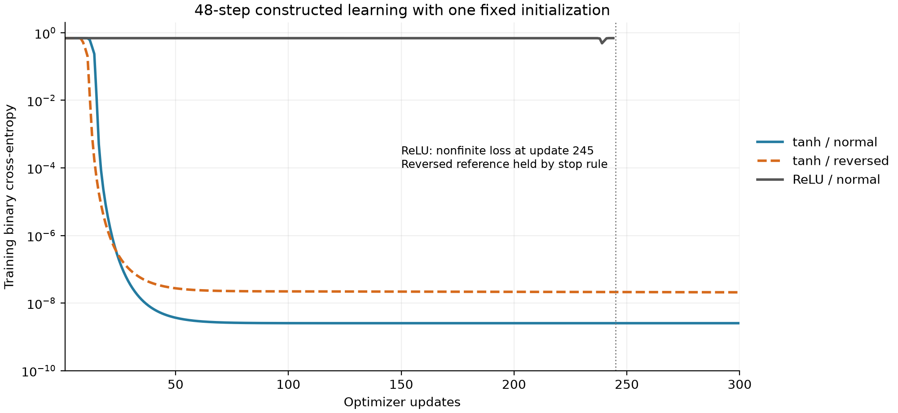

# Full-length learning: tanh passes; ReLU reference stops numerically

The equation-led **I-SEQ-tanh-cells** alternative passes both full-width,
48-step constructed learning cases: **100% held-out accuracy** and clipped
BCE about1e-7 after300 updates, for normal and reversed labels. Initial
weights match the ReLU reference and the earlier GPU initialization exactly.
Fresh-process GPU verification reproduces probabilities, decoder outputs
and attention without changing weights or optimizer state.

The comparison stopped as declared when ReLU-normal developed nonfinite
loss atupdate245. Its final weights and predictions are nonfinite;
ReLU-reversed was therefore not run. **This is not a completed four-case
comparison or a completed ReLU failure at300 updates.** The original failed
result remains intact. No CER inputs, research fits, new seeds or website work.

## Source-explicit change

[The contract](../../SEQUENTIAL_RECURRENT_CONTROL.md) was written before
new learning outputs. The complete paper was previously read; complete
pages2678,2679,2682 and2683 were re-read and visually checked. Algorithm1
lines11/13,30/32 and42 explicitly use tanh for LSTM candidates/hidden outputs
and GRU candidates; SectionIV-C selects ReLU hidden activation. That conflict
remains visible. This is an equation-led native-cell interpretation, not a
literal implementation of all Algorithm1 operations or unique author code.

Only `cell_activation` changes: all six LSTM and eight GRU cells use tanh
in the alternative. Sigmoid gates, scalar-Sigmoid bridge, attention/state
mapping, ReLU Dense head, final Sigmoid, repaired BCE, Adam.001, MaxNorm1,
no dropout, native kernels, float32 and all initializers stay fixed. The
change affects LSTM candidate/cell-to-hidden and GRU candidate operations
together; it does not isolate their individual contributions.

The direct implementation now serializes relu/tanh explicitly, with ReLU as
the historical default. Legacy and new archives pass fresh-process software
regression checks. Other detector functions and the other four direct files
are unchanged. The current research CLI still uses its original ReLU path;
it must not be mistaken for a wired/timed tanh research runner.

## Fixed gate and outcomes

Same model seed20260920, data seed20260926,9,240,802 parameters,32 training
and32 fresh test profiles,48 steps. Each profile is a class-dependent constant
mean plus small Gaussian noise. Reversed labels flip both train and test
labels; **this is not a poisoning experiment**. The sign-of-mean rule solves
both orientations exactly, while a constant prior gives50% accuracy/BCE log(2).
Passing demonstrates basic learning on a trivial task, not temporal capability,
reconstruction quality, theft detection or robustness.

| Cell activation | Labels | Updates | Held-out accuracy | Clipped test BCE | Outcome |
|---|---|---:|---:|---:|---|
| tanh | Normal | 300 | 100% | 1.00000005e-7 | All constructed checks pass |
| tanh | Reversed | 300 | 100% | 1.00000005e-7 | All constructed checks pass |
| ReLU | Normal | 245 | Undefined | Undefined | Nonfinite loss; stop |
| ReLU | Reversed | Not run | — | — | Held by the declared stop rule |

Each completed fit used final weights, not a selected earlier checkpoint.
Fit times were265.69s and263.52s for tanh normal/reversed; ReLU-normal ran
221.04s before its numerical stop. Its loss was near log(2) for most of the run, briefly fell to0.48902 at
update239, then rose to0.69411 at244. This is not a converged flat plateau;
intermediate classification accuracy was not measured. At245 the loss is
stored as null, and all9,240,802 final
parameter values are nonfinite. Do not substitute50% for an invalid final
accuracy or infer the precise earlier update where corruption first arose.

The plot shows raw Keras training BCE. Reported test BCE uses the previously
frozen probability clip of1e-7, so its floor differs from the smaller raw
training losses. The marker identifies the stop update, not a fabricated
finite loss. [SVG](learning-curves.svg) and [plot script](plot_learning.py)
are preserved.

The unchanged gate required both tanh orientations to complete300 updates,
achieve at least90% held-out accuracy/BCE<log(2)/2, retain finite connected
gradients and changed parameter groups, satisfy constraints, and reload
exactly. All pass. Observed recurrent hidden outputs obey the tanh bound;
the ReLU classifier hidden layer is not claimed to be bounded by1.

## Execution and preserved failure

Scientific model/contract freeze: `6ca174a8e58cd47ccb5af656f1cbfa534c29a156`.
Execution recovery: `febc28e4aaf626302f884524c1184a79f59b2c02`.

| Panther job | Allocation elapsed | Result |
|---|---:|---|
| 408764 | 3:04 | Pre-fit device-scope error; zero full-width fitting updates |
| 408778 | 18:08 | Two completed tanh fits, then declared stop at nonfinite ReLU update245 |
| 408787 | 0:32 | Fresh-process verification of the two completed models; zero fitting updates |

All used oneV100-16GB and4CPUs/16GiB. Total actual allocation **21:44**,
within the original35-minute budget. After the first failure, the retry ceiling
was reduced to31min; the final verification ceiling was3min. No time guard
was extended and no failed/completed comparison fit was repeated.

The first job's broad GPU scope incorrectly requested the CPU-only
TensorSliceDataset operation onGPU. All six software checks had passed,
but the full-width case never reached its first fitting update. Its initial
weights/predictions/layer arrays and failed result are preserved under
[attempt1](attempt1/result.json), with [log](attempt1/slurm-408764.txt) and
[accounting](attempt1/attempt1-accounting.txt). The recovery scoped GPU placement
to model variables, left the input pipeline onCPU, and reproduced every
saved initial array fromattempt1 before fitting. The model, data, seed,
optimizer and schedule were unchanged.

Job408778's failure code reflects the predeclared numerical stop. It did not
run the missing reference case or reach the wrapper's final fresh-process
verification. A separate audit-only job completed that already planned
verification for the two finished models. It did not resume training, alter
the failed result or evaluate a new model/input. All original failure files
remain unchanged.

## Audit and scope

[Partial-comparison artifact audit](partial_artifact_audit.json) verifies the
three preserved cases, their input identities, initializations, histories,
metrics, layer summaries and serialized state. The failed reference remains
nonfinite with245 optimizer updates; it is not admitted as a complete fit.
[Fresh GPU reload](fresh_tanh_reload.json) verifies both completed models'
probabilities, intermediate outputs, attention, weights and optimizer state
exactly. [Audit code](close_audit.py) preserves these distinctions.

All29 attempt2 files match [Panther hashes](attempt2-sha256.txt), all15
original pair files remain unchanged, and attempt1 is preserved. Twenty
relevant pinned neural checks,405 repository cases and the placement
regression pass;45 environment-specific skips are recorded. Strict data
verification retains the established ScienceDB semantic-equivalence branch;
restricted official archives remain unavailable locally. No research model
was inferred or fitted locally. Journal consistency passes; website untouched.

[Raw comparison result](result.json) retains status failed/incomplete.
Completed and failed case records and histories remain separate:
[tanh normal](tanh_normal_result.json), [tanh reversed](tanh_reversed_result.json),
[ReLU normal](relu_normal_result.json). [Execution record](execution.json),
[retry accounting](attempt2-accounting.txt), [retry log](slurm-408778.txt),
[verification accounting](verification-accounting.txt), and
[verification log](slurm-408787.txt) preserve the complete allocation history.
Raw models and arrays remain locally/onPanther under the two
`sequential-cell-learning-20261002-attempt*` directories.

## Next decision

The tanh interpretation is now eligible for a separately specified research
pilot; it is not a reproduced paper result or demonstrated poisoning repair.
One ReLU orientation failed numerically in this fixed comparison; the other
was not tested. Neither result is a model-family impossibility claim.

Next specify and explicitly wire the exact tanh alternative for a bounded
original p00/p30 CER pair, with fresh initial weights and a new full-batch
runtime gate. Do not reuse the synthetic trained weights or silently launch
the original ReLU CLI. No CER fitting follows automatically from this gate.
