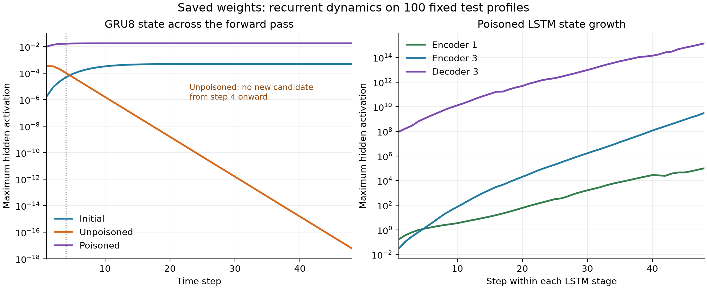

# Why the saved recurrent states vanish or amplify

The gate equations explain both endpoints of the failed sequential pilot.
In the unpoisoned model, GRU8 stops injecting candidates after its third
step and repeatedly retains about half its state. In the poisoned model,
positive recurrent contributions enter the ReLU LSTM cell memories through
open gates, amplifying state through the encoder and decoder. These are
fixed-weight forward-pass mechanisms, not a reconstruction of training onset.

Panther **job 408551 completed 0:0 in 3:05**, on one V100-16GB, 4 CPUs/16 GiB.
The diagnostic program took 56.13s; the allocation also includes constructed
checks, startup and saved-array auditing. **Zero fits or optimizer updates.**
All 21 cell traces match native arithmetic exactly; the saved sequence checks,
model/optimizer hashes and original artifacts verify. The local audit matches
cluster bytes.

The curves show maxima across the same 100 test profiles and each layer's
units. Encoder and decoder have separate 48-step passes; these axes are not
training epochs. [SVG](gate-dynamics.svg) is also preserved.

## Frozen observation

Code and [plan](../../../../docs/plans/2026-10-02-sequential-gate-arithmetic.md):
`ee1a420656cfa28d47008d12a550ea63f6145bd5`. Three saved weight states:
shared initialization, finalp00, finalp30. Same first 100 test rows as the
[previous diagnostic](../sequential_saved_state_20261002/README.md), same
batch order, no labels used. The five scientific files remain unchanged.

All three encoder LSTMs, three decoder LSTMs and GRU8 are replayed through
48 steps. Manual gate equations are compared with the pinned native cells;
native states drive the next step. Initial-state mapping, attention and
feedback remain unchanged. The native top-encoder, decoder-hidden and GRU8
sequences reproduce the previously saved outputs exactly. Model/optimizer
hashes are unchanged, with counts 0/2250/2250 for the three states.

Batch state sequences and GRU injection/retention arrays are preserved in
full. Detailed LSTM gate witnesses use rows 0/1 plus the row containing the
largest final hidden value, with first-index tie breaking, as declared before
results. These witnesses explain extremes; they are not representative
samples or an accuracy evaluation.

## Unpoisoned GRU8: candidate shutoff followed by geometric decay

Under the native Keras gate convention,
`h[t] = z[t] * h[t-1] + (1-z[t]) * ReLU(candidate_pre[t])`.
The number of positive candidate coordinates across 100 profiles ×300 units
is 500, 400, 200 in steps 1–3, and **zero throughout steps 4–48**. The largest
candidate preactivation is already negative at step 4 (-2.739e-5).
Update gates stay near 0.5, so no new candidate state enters and the residual
is repeatedly halved.

| Step | Maximum GRU8 state | Positive candidates /30,000 |
|---|---:|---:|
| 1 | 3.374e-4 | 500 |
| 3 | 2.019e-4 | 200 |
| 4 | 1.010e-4 | 0 |
| 8 | 6.329e-6 | 0 |
| 16 | 2.486e-8 | 0 |
| 32 | 3.836e-13 | 0 |
| 48 | 5.919e-18 | 0 |

From step 4 onward, the endpoint is the step 3 state multiplied by the
remaining update gates. The full retained/injected-state identity reproduces
the final state with maximum absolute error 8.26e-25 in independent float64
accumulation. The trace's manual/native float32 step errors are exactly zero.
The initial model continues injecting candidates through step 48, so this is
not an unavoidable property of every initialization of this architecture.

The strongest final-state witness is batch row 50/unit 187 (zero-based):

| Step | Input candidate term | Recurrent term | Bias | Candidate preactivation |
|---|---:|---:|---:|---:|
| 1 | -0.000387852 | 0 | +0.001062810 | +0.000674958 |
| 3 | -0.000986443 | +0.000000693 | +0.001062810 | +0.000077060 |
| 4 | -0.001123014 | +0.000000427 | +0.001062810 | -0.000059777 |
| 48 | -0.001298991 | about 2.64e-20 | +0.001062810 | -0.000236181 |

Its **positive** bias is overcome by increasingly negative input projection.
Thus negative candidate bias is not a universal explanation for the shutoff.
Other units do have a local bias contribution: at step 48, omitting only the
bias term at the observed states makes 13,000 candidates positive. This is a
conditional algebraic comparison, not a bias-reset trajectory or working repair.

## Poisoned LSTMs: retained memory plus recurrent candidate injection

The declared ReLU/native LSTM obeys
`c[t] = f[t]*c[t-1] + i[t]*ReLU(x[t]Kc + h[t-1]Uc + bc)`,
`h[t] = o[t]*ReLU(c[t])`.
A forget gate bounded by 1 cannot itself increase the magnitude of its
retained cell contribution. The injection term adds new positive memory;
output gates can expose that accumulated memory as large hidden values.

At the first encoder's largest final-hidden witness (row 42/unit 323), the
step 48 gates are exactly`i=f=o=1`. Input, recurrent and bias candidate terms
are 0.280883,26,951.291016 and0.025655. Retained memory is 72,659.453125 and
new injection 26,951.597656, producing native cell/hidden state 99,611.046875
with float32 rounding. The recurrent contribution dominates this witness;
the large state is not supplied by an equally large raw input.

| Layer | Initial maximum h atstep 48 | Final p00 | Final p30 |
|---|---:|---:|---:|
| Encoder 1 | 0.3566 | 0.3546 | 9.961e4 |
| Encoder 2 | 0.2488 | 0.2477 | 4.766e8 |
| Encoder 3 | 0.1198 | 0.1195 | 3.116e9 |
| Decoder 1 | 0.05194 | 0.05148 | 1.347e13 |
| Decoder 2 | 0.02506 | 0.02341 | 3.208e14 |
| Decoder 3 | 0.008243 | 0.01032 | 1.394e15 |

The predeclared maximum-final-hidden witness in each poisoned LSTM has
`i=f=o=1` at step 48. In decoder 3's witness, retained memory is 1.038e15 and
injection 3.560e14; the candidate's recurrent term 2.854e14 exceeds its input
term 7.067e13. Gates vary earlier in the pass—this is not a claim that all
gates/units are open throughout. All observed values remain finite.

This explains how large hidden values coexist with the previously verified
kernel-column norm constraints. A constructed control also shows native
multiunit ReLU LSTM state growth with unit recurrent-column norms. Neither
observation is an infinite-time stability proof. The resulting bridge
saturation and loss of profile distinctions were established by the prior
saved-state diagnostic; no new classifier result was fitted here.

## What follows

We can now locate the native forward mechanisms more precisely than
“the model did not learn”: no new GRU8 candidate after step 3, and recurrent
LSTM amplification with admitted positive candidate memory. We still do not
know when during training the parameters entered these regimes, or whether
one parameter change would repair the jointly trained model.

The native ReLU completion remains one interpretation of conflicting source
activation/cell descriptions, not uniquely specified author code. The next
useful step is to define one source-explicit recurrent-cell alternative or
control and require a full 48-step constructed learning check before any
new CER fit. No alternative, repaired trajectory, seed or follow-up job is
selected or launched by this result. Other source choices, full-population
performance, mechanism attribution and broad attainability remain open.

## Audit and preservation

All 45 transferred files match [Panther hashes](artifact-sha256.txt).
All 15 original pair files and 10 previous diagnostic files remain unchanged.
Four local/cluster gate controls pass; 403 repository cases pass with 41
runtime-specific skips. Strict data verification retains the established
ScienceDB semantic-equivalence branch; restricted official archives remain
unavailable locally. Journal consistency passes; the website is unchanged.

The [audit](artifact_audit.json) checks 21 cell traces: every full-batch native
state summary, full-batch GRU retention/injection, fixed/extreme witness gate
identities, source/output hashes and nine saved sequence comparisons.
LSTM batchwide gate distributions are outputs of the frozen observer; detailed
local gate-identity replay uses the declared raw witnesses. No model call ran
locally for the research observations or audit.

[Execution](execution.json), [accounting](accounting.txt),
[Slurm log](slurm-408551.txt), [summary](summary.json) and
[summary/figure script](derive_summary.py) are preserved. The complete
[raw JSON report](result.json.gz) is stored losslessly compressed; its
uncompressed SHA256 is
`b010297ff0cf791df675ebf8be9ad772ad3f9e6c07260964a417b24a28c57fef`.
Canonical uncompressed reports and NPZ traces remain locally and on Panther
in `data/derived/takiddin-2021-robust-poisoning/sequential-gates-20261002-attempt1`.
The figure and concise summary are post-run reductions of these saved data,
not additional model evaluations. Stop this diagnostic.
